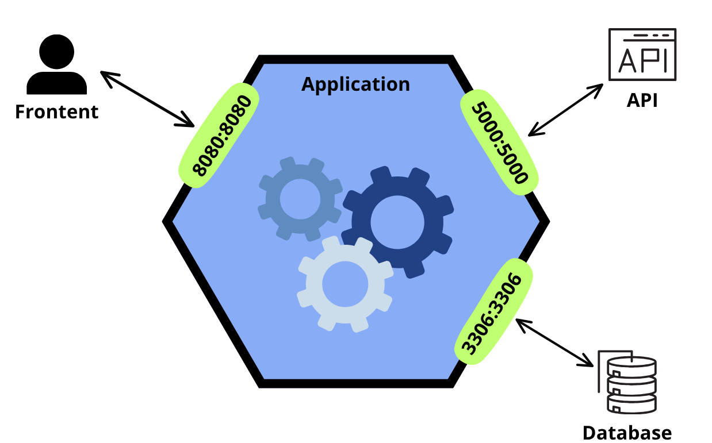

<p align="center">
    
</p>

<p align="center">
    
    
    
</p>

## Descripción del Proyecto.

Aplicación web que se encarga de simular el funcionamiento y lógica de una tienda de videojuegos en linea, con el objetivo de
aprender y aplicar conceptos de seguridad en Spring Boot, asi como comprender y poner en práctica el uso de métodos CRUD y sesiones
HTTP en el desarrollo web.

### ¿Que puedes hacer con esta tienda?

 * **Registro e Inicio de Sesión:** Los usuarios pueden crear una cuenta y acceder a la tienda mediante una autenticación segura.

 * **Navegación entre Juegos:** Explorar un gran y amplio catálogo de videojuegos con información detallada, incluyendo su nombre, descripción,
precio y mucho más.

 * **Carrito de Compras:** Permite añadir y/o eliminar juegos dentro del carrito de la compra de un usuario, permitiendo seleccionar únicamente
los juegos que el usuario desea comprar.

 * **Simular la Compra:** Permite simular la compra de los juegos seleccionados por el usuario dentro su carrito de la compra.

## Arquitectura/Estructura del Proyecto.

<p align="center">
    <figure>
        
        <figcaption><strong>Figura 1.</strong> Arquitectura del Proyecto.</figcaption>
    </figure>
</p>

Como se logra apreciar en la imagen, nuestro sistema se compone en varios módulos/componentes que trabajan de forma paralela y sincronizada para
garantizar el correcto funcionamiento del sistema. Estos módulos/componentes son:

 - **Application:** Es el *núcleo* del sistema, donde se define e implementa la lógica de negocio de nuestra tienda. Este componente se encarga
 de coordinar y gestionar la comunicación con el resto de componentes de la aplicación.

 - **Frontent (Puerto 8080):** Expone y muestra, la interfaz de la aplicación web permitiendo que los usuarios navegar entre sus diferentes páginas
 y elementos.

 - **API (Puerto 5000):** Expone la API encargada de procesar y obtener toda la información de los juegos que es mostrada a lo largo de la tienda
 y sus diferentes páginas.

 - **Database MySQL (Puerto 3306):** Expone la base de datos MySQL encarga de gestionar y recuperar los datos de los usuarios registrados dentro
 del sistema. Así como, coordinar y gestionar el registro de nuevos usuarios dentro del sistema.

## Tecnologías utilizadas.

Una vez explicada la estructura, exponemos y explicamos las diferentes tecnologías empleadas durante el desarrollo e implementación de nuestro
proyecto:

 - **Spring Boot:** Define el backend de nuestra aplicación, ofreciendo un backend sencillo y robusto que se encarga de encapsular toda la lógica
 de negocia de nuestra tienda.

 - **Python:** Gestiona y coordina la comunicación con la API, y se encarga de recuperar toda la informacion de los juegos que se muestra a través
 de las diferentes páginas que definen la tienda.

 - **MySQL:** Define la lógica y estructura de la base de datos relacional utilizada para guardar y recuperar los datos de los usuarios.

 - **HTML/CSS/JavaScript:** Define la estructura, diseño y comportamiento de las diferentes páginas web de nuestra tienda.

 - **Tailwind CSS:** En combinación con CSS, se utiliza para dar un estilo claro y sencillo a cada una de las diferentes páginas web de nuestra tienda.

 - **Font Awesome:** Define los diferentes iconos que se a lo largo de las páginas web de nuestra tienda.

 - **Docker:** Encargado de coordinar, gestionar y poner en marcha nuestro sistema a través de servicios, uno por cada de los módulos que la componen.

## ¿Cómo ejecutar el proyecto?

### 1. Clonar el repositorio.

Primero, será necesario clonar el repositorio del proyecto en tu máquina local:

```
git clone https://github.com/AitorBlanco03/Distribuidos-P3-Spring.git
cd Distribuidos-P3-Spring
```
En caso de no tenerlo instalado Git, siempre es posible descargar el zip con el proyecto.

### 2. Ejecutarlo usando Docker.

Una vez contado con el repositorio, se usará Docker para levantar el contenedor junto a los servicios y contenedores necesarios.

```
docker-compose up
```

**PD:** Este comando puede que falle en un primer momento. Si eso sucede, intenta reiniciar todo sin detener ninguno de los servicios ya levantados.
Esto se debe a que Spring Boot requiere que la base de datos este activa para arrancar y funcionar correctamente.

## Bibliografía recomendada.

* [TailwindCSS - Docs](https://tailwindcss.com/docs/styling-with-utility-classes)
* [Font Awesome - How to Add Icons](https://docs.fontawesome.com/web/add-icons/how-to)
* [RAWG API](https://rawg.io/apidocs)
* [RAWG API - Docs](https://api.rawg.io/docs/)
* [Flask Docs - Aplicaciones Modulares con Blueprints](https://flask-es.readthedocs.io/blueprints/)
* [Geeks for Geeks - Getting Started with APIs](https://www.geeksforgeeks.org/python-api-tutorial-getting-started-with-apis/)
* [Geeks for Geeks - How to Call or Consume External API in Spring Boot?](https://www.geeksforgeeks.org/how-to-call-or-consume-external-api-in-spring-boot/)
* [Geeks for Geeks - Spring Boot - Session Management](https://www.geeksforgeeks.org/spring-boot-session-management/)
* [Cómo leer y procesar un archivo JSON en Spring Boot usando JsonNode](https://itinajero.dev/como-leer-y-procesar-un-archivo-json-en-spring-boot-usando-jsonnode/)
* [Baeldung - Spring MVC and the @ModelAttribute Annotation](https://www.baeldung.com/spring-mvc-and-the-modelattribute-annotation)
* [Baeldung - Spring @PathVariable Annotation](https://www.baeldung.com/spring-pathvariable)
* [Parzibyte's blog - Leer variables de ruta con Spring Boot](https://parzibyte.me/blog/2019/08/26/variables-ruta-spring-boot/)
* [Spring @PathVariable y segmentos de url](https://www.arquitecturajava.com/spring-pathvariable-y-segmentos-de-url/)
* [TailwindFlex - Product details page](https://tailwindflex.com/@dika99/product-details-page)
* [Creative Tim - Header NIMBUS desktop](https://www.creative-tim.com/twcomponents/component/header-nimbus)